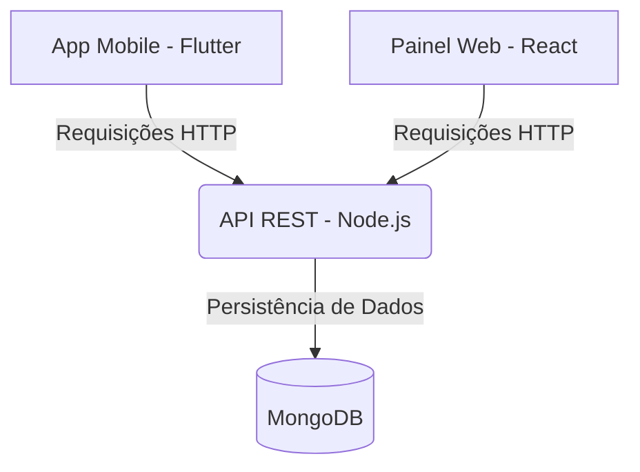

# Sistema de Monitoramento e Integração de Entregas — Jac Cosméticos

> **Status do Projeto:** 🚀 Em desenvolvimento (Ambiente de Estágio)

Esta aplicação foi desenvolvida sob medida para a **V.M Perfumaria e Cosméticos Ltda E.P.P (Jac Cosméticos)** como solução tecnológica para o processo de modernização logística e operacional da empresa. O sistema automatiza o fluxo de despachos e monitoramento de entregas de produtos cosméticos em tempo real, eliminando processos manuais.

---

## Sobre o Projeto

O ecossistema é composto por três soluções integradas que conectam a gerência da loja aos entregadores na rua:

1. **API REST (Back-end):** Centraliza as regras de negócio, autenticação e comunicação entre as plataformas.
2. **Painel Web (Front-end):** Console focado na gerência, onde são cadastrados os pedidos, despachadas as rotas e monitorados os indicadores em tempo real (*dashboards*).
3. **Aplicativo Mobile:** Ferramenta ágil para o time de funcionários e entregadores realizarem a baixa das entregas, atualização de status e visualização de rotas.

---

## Tecnologias Utilizadas

A arquitetura do projeto foi desenhada utilizando tecnologias modernas do ecossistema de desenvolvimento de software, dividida em três pilares:

### Back-end

* **Node.js**: Plataforma de desenvolvimento assíncrona orientada a eventos para a construção da API.
* **Express**: Framework minimalista para gerenciamento de rotas e middlewares.
* **MongoDB**: Banco de dados NoSQL baseado em documentos, ideal para a flexibilidade e escalabilidade do histórico de entregas.
* **Mongoose**: Ferramenta de modelagem de objetos para mapeamento de dados do MongoDB.

### Front-end (Web)

* **React**: Biblioteca baseada em componentes para a criação de uma interface de gerenciamento rica e responsiva.
* **Recharts / Chart.js**: (Opcional, altere se usar outra) Para a renderização gráfica dos indicadores operacionais nos *dashboards*.

### Mobile

* **Flutter**: Framework UI do Google para o desenvolvimento do aplicativo multiplataforma de forma nativa e performática.

---

## Funcionalidades Principais

### Painel Web Administrativo

* **Dashboard Gerencial:** Gráficos com indicadores de entregas realizadas, atrasos, rotas mais frequentes e desempenho dos entregadores.
* **Gestão de Entregas:** Tela para inserção, edição e cancelamento de pedidos de entrega baseados no estoque de cosméticos.
* **Atribuição de Rotas:** Vínculo direto de um lote de pacotes a um entregador específico.

### Aplicativo Mobile (Entregadores)

* **Autenticação Segura:** Login individual para funcionários e entregadores parceiros.
* **Lista de Tarefas Diárias:** Visualização clara das entregas atribuídas para o dia.
* **Atualização de Status com Um Toque:** Alteração em tempo real do estado do pacote (*Pendente*, *Em Rota*, *Entregue*, *Insucesso*).

---

## Arquitetura do Sistema



---

## Design da Aplicação (UX/UI)

Antes da escrita do código, toda a interface gráfica, fluxo de navegação e experiência do usuário (UX/UI) foram planejados e prototipados utilizando o **Figma**. O objetivo foi desenhar telas limpas, modernas e de fácil usabilidade para os funcionários e entregadores da loja.

### Protótipos de Alta Fidelidade

O projeto visual engloba soluções visuais para as duas frentes da aplicação:

* **Painel Web (React):** Desenvolvido com foco em produtividade, utilizando um *layout* em estilo *dashboard* com menu lateral fixo, cartões (*cards*) informativos e tabelas limpas para monitoramento massivo de dados.
* **Aplicativo Mobile (Flutter):** Projetado com foco em usabilidade sob luz solar e operação rápida na rua, utilizando botões amplos, contrastes marcantes para leitura ágil dos status das entregas e navegação intuitiva em poucos cliques.

### 🔗 Acesse o Projeto no Figma

Você pode visualizar e interagir com o fluxo de telas através do link do projeto público:

👉 **[Acessar Protótipo Interativo no Figma](https://www.figma.com/design/vRPMTsswVjl4uLH33xDoxK/Jac-Delivery?node-id=0-1&t=1sFnaceaOT6JGSY3-1)**

> **Nota:** O *design system* utilizou uma paleta de cores inspirada na identidade visual da marca (Jac Cosméticos), equilibrando tons profissionais com cores de alerta estritas para os status logísticos (como *Pendente*, *Em Rota* e *Concluído*).

---

## 🚀 Como Executar o Projeto

### Pré-requisitos

Antes de começar, certifique-se de ter instalado em sua máquina:

* [Node.js](https://nodejs.org/)
* [Flutter SDK](https://docs.flutter.dev/get-started/install)
* Um cluster local ou na nuvem do [MongoDB](https://www.mongodb.com/)

### 1. Clonar o Repositório

```bash
git clone https://github.com/pedro-ls-hernandes/Jac-Delivery
cd Jac-Delivery

```

### 2. Configurar o Back-end

```bash
# Navegue até a pasta da API
cd backend

# Instale as dependências
npm install

# Crie um arquivo .env na raiz da pasta backend e configure as variáveis
PORT=3000
MONGODB_URI=sua_string_de_conexao_do_mongodb

# Inicie o servidor
npm run dev

```

### 3. Configurar o Front-end Web

```bash
# Navegue até a pasta da aplicação web
cd ../frontend-web

# Instale as dependências
npm install

# Inicie a aplicação em ambiente de desenvolvimento
npm start

```

### 4. Configurar o Aplicativo Mobile

```bash
# Navegue até a pasta da aplicação mobile
cd ../mobile

# Baixe os pacotes do Flutter
flutter pub get

# Execute a aplicação em um emulador ou dispositivo físico conectado
flutter run

```

---

## Vínculo Acadêmico

Este projeto foi idealizado e implementado como parte dos requisitos práticos do estágio supervisionado para o curso de Desenvolvimento de Software Multiplataforma da **Fatec**, aplicando conceitos de engenharia de software, arquitetura de sistemas e gerência de banco de dados no mercado real.

---

> Desenvolvido por **Pedro Hernandes** - Sinta-se à vontade para entrar em contato via [LinkedIn](https://www.linkedin.com/in/pedro-ls-hernandes/).
