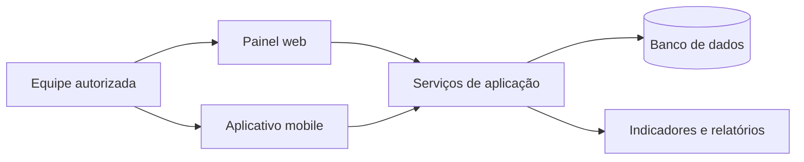
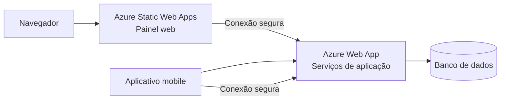
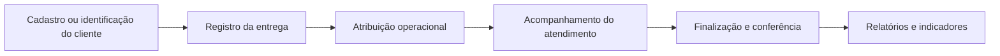
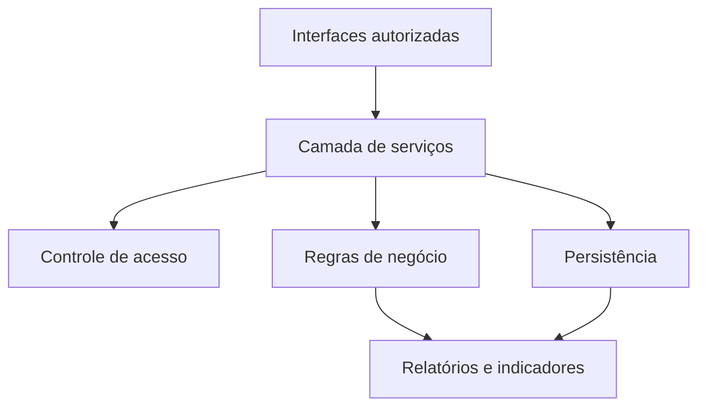
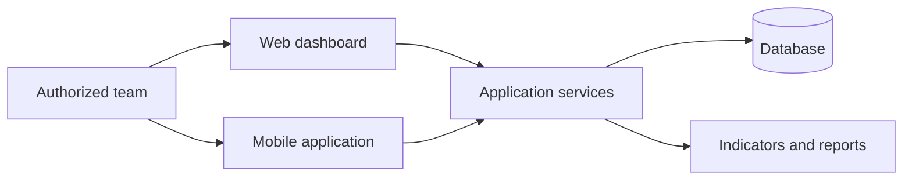
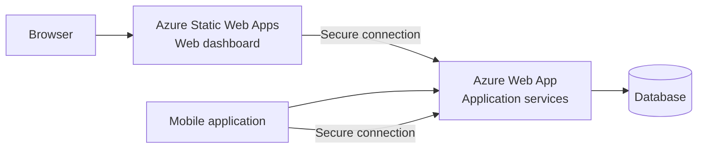



<strong>Documentação em português</strong>

# Jac Delivery

> **Repositório vitrine:** este repositório apresenta o serviço Jac Delivery para fins institucionais, comerciais e de avaliação técnica. Ele não contém o código-fonte, credenciais, dados reais ou configurações privadas da solução.

## Sobre o serviço

O Jac Delivery é uma plataforma de gestão de entregas para operações de venda, distribuição e logística local. A solução apoia o cadastro de clientes e equipes, o acompanhamento de entregas, a organização de operações terceirizadas, a geração de indicadores e a emissão de relatórios.

Esta documentação descreve o produto em nível conceitual. Os detalhes de implementação, endpoints, regras internas, infraestrutura privada e procedimentos de operação pertencem aos ambientes restritos do serviço.

## Visão geral da solução

A solução possui três frentes integradas:

- **Painel web:** interface administrativa e operacional.
- **Serviços de backend:** camada responsável pelas regras, integrações e persistência.
- **Aplicativo mobile:** interface móvel para rotinas autorizadas da operação.

```mermaid
flowchart LR
    U["Equipe autorizada"] --> W["Painel web"]
    U --> M["Aplicativo mobile"]
    W --> A["Serviços de aplicação"]
    M --> A
    A --> D[("Banco de dados")]
    A --> R["Indicadores e relatórios"]
```

## Arquitetura em nuvem

Em produção, a solução utiliza serviços Azure para disponibilização das interfaces e dos serviços de aplicação:

- **Azure Static Web Apps:** hospeda e distribui o painel web compilado.
- **Azure Web App:** executa os serviços de backend e disponibiliza a camada de integração para os clientes autorizados.
- **Banco de dados gerenciado:** armazena os dados operacionais por meio de configurações protegidas.

```mermaid
flowchart LR
    B["Navegador"] --> S["Azure Static Web Apps<br/>Painel web"]
    M["Aplicativo mobile"] --> A["Azure Web App<br/>Serviços de aplicação"]
    S -->|Conexão segura| A
    M -->|Conexão segura| A
    A --> D[("Banco de dados")]
```

A comunicação entre as frentes ocorre por conexões seguras. As credenciais, URLs privadas, configurações de ambiente e mecanismos internos de autorização não fazem parte deste repositório público.

## Capacidades do produto

- Gestão de clientes e informações de entrega.
- Cadastro e acompanhamento de vendedores.
- Cadastro de entregadores para associação operacional, relatórios e pagamentos.
- Organização de entregas próprias e terceirizadas.
- Associação de entregas a grupos de entregadores sem exigir o cadastro de uma pessoa específica.
- Acompanhamento do ciclo operacional de uma entrega.
- Registro de informações financeiras e administrativas da operação.
- Indicadores, relatórios e documentos de apoio à gestão.
- Acesso por perfis e permissões definidos no ambiente privado do serviço.

## Perfis de uso

| Perfil | Finalidade |
|---|---|
| **Administrador** | Gerencia cadastros, configurações, operação, indicadores e relatórios. |
| **Vendedor** | Registra e acompanha entregas conforme as permissões concedidas. |
| **Entregador cadastrado** | É mantido como registro operacional para associação, relatórios e pagamentos; não representa um usuário de acesso nesta versão. |
| **Grupo de entregadores** | Representa uma operação terceirizada quando não há necessidade de cadastrar individualmente o entregador. |

## Fluxo conceitual da operação

```mermaid
flowchart LR
    C["Cadastro ou identificação do cliente"] --> E["Registro da entrega"]
    E --> A["Atribuição operacional"]
    A --> T["Acompanhamento do atendimento"]
    T --> F["Finalização e conferência"]
    F --> R["Relatórios e indicadores"]
```

O sistema permite que a operação escolha entre uma associação individual ou uma associação por grupo terceirizado. Os estados, validações e transições detalhados são controlados pelo serviço privado.

## Integrações e camadas

```mermaid
flowchart TD
    UI["Interfaces autorizadas"] --> API["Camada de serviços"]
    API --> AUTH["Controle de acesso"]
    API --> RULES["Regras de negócio"]
    API --> DATA["Persistência"]
    RULES --> REPORTS["Relatórios e indicadores"]
    DATA --> REPORTS
```

A arquitetura separa apresentação, serviços, regras de negócio, persistência e relatórios. Essa separação permite evoluir o painel, o aplicativo e os serviços de forma independente.

## Tecnologias

### Aplicação

- Node.js e Express no backend.
- MongoDB e Mongoose na persistência.
- React e Vite no painel web.
- Flutter e Dart no aplicativo mobile.
- Bibliotecas de interface, formatação e geração de relatórios.

### Nuvem

- Azure Web App para os serviços de backend.
- Azure Static Web Apps para o painel web.
- Banco de dados gerenciado acessado por configuração protegida.
- HTTPS para comunicação entre clientes e serviços.

## Requisitos funcionais em alto nível

- Autenticar e autorizar usuários conforme seus perfis.
- Manter cadastros necessários à operação.
- Registrar, acompanhar e concluir entregas.
- Permitir operações próprias ou terceirizadas por grupo.
- Associar entregas a registros individuais ou grupos, conforme o cenário.
- Disponibilizar indicadores e relatórios administrativos.
- Preservar rastreabilidade das operações e informações financeiras.

## Requisitos não funcionais em alto nível

- Proteger credenciais, dados pessoais e informações operacionais.
- Utilizar conexões seguras entre interfaces e serviços.
- Restringir o acesso conforme permissões definidas pela empresa.
- Manter separação entre apresentação, serviços e persistência.
- Permitir evolução independente do painel e do aplicativo.
- Disponibilizar a solução em infraestrutura de nuvem controlada.
- Evitar exposição de dados reais, segredos ou configurações privadas no repositório público.

## Capturas de tela

Capturas de tela contém informações fictícias e não sensíveis à empresa.

| Captura | Imagem | Legenda |
|---|---|---|
| Visão geral |  | Painel principal com indicadores e resumo das entregas. |
| Nova entrega |  | Formulário de criação de entrega e pagamento. |
| Lista de entregas |  | Consulta, filtros e ações operacionais. |
| Pessoas e grupos |  | Gestão de vendedores, cadastros e grupos terceirizados. |
| Relatórios |  | Métricas, relatórios e informações de pagamento. |

## Licenciamento e divulgação

Este repositório contém documentação institucional e técnica resumida do serviço Jac Delivery. O conteúdo é disponibilizado para apresentação, avaliação e divulgação da solução.

O código-fonte proprietário, marcas, logotipos, imagens, APIs, infraestrutura, regras internas e demais componentes do serviço não estão licenciados para cópia, alteração, distribuição ou uso comercial sem autorização prévia.

A publicação deste material deve ser autorizada pelos responsáveis pela empresa. Todos os direitos reservados.

## Escopo do repositório

Este repositório público não contém código-fonte, credenciais, dados reais, arquivos de ambiente, URLs privadas, instruções de implantação ou procedimentos para execução local.

Para acesso ao serviço, demonstração ou informações comerciais, utilize os canais oficiais da empresa.

<strong>Documentation in English</strong>

# Jac Delivery

> **Showcase repository:** this repository presents the Jac Delivery service for institutional, commercial and technical evaluation purposes. It does not contain source code, credentials, real data or private configuration.

## About the service

Jac Delivery is a delivery management platform for local sales, distribution and logistics operations. It supports customer and team records, delivery tracking, outsourced operations, indicators and management reports.

This document describes the product at a conceptual level. Implementation details, endpoints, internal rules, private infrastructure and operational procedures belong to restricted service environments.

## Solution overview

The solution has three integrated fronts: a web dashboard, backend services and a mobile application.

```mermaid
flowchart LR
    U["Authorized team"] --> W["Web dashboard"]
    U --> M["Mobile application"]
    W --> A["Application services"]
    M --> A
    A --> D[("Database")]
    A --> R["Indicators and reports"]
```

## Cloud architecture

In production, the solution uses Azure services for its interfaces and application services:

- **Azure Static Web Apps:** hosts and distributes the compiled web dashboard.
- **Azure Web App:** runs backend services and provides the integration layer for authorized clients.
- **Managed database:** stores operational data through protected configuration.

```mermaid
flowchart LR
    B["Browser"] --> S["Azure Static Web Apps<br/>Web dashboard"]
    M["Mobile application"] --> A["Azure Web App<br/>Application services"]
    S -->|Secure connection| A
    M -->|Secure connection| A
    A --> D[("Database")]
```

Private credentials, URLs, environment settings and internal authorization mechanisms are not part of this public repository.

## Product capabilities

- Customer and delivery information management.
- Salesperson records and delivery tracking.
- Courier records for operational association, reporting and payments.
- Own and outsourced delivery operations.
- Delivery assignment to courier groups without requiring an individual courier record.
- Operational delivery lifecycle tracking.
- Administrative and financial operation records.
- Indicators, reports and management documents.
- Role-based access defined in the private service environment.

## Usage profiles

| Profile | Purpose |
|---|---|
| **Administrator** | Manages records, settings, operations, indicators and reports. |
| **Salesperson** | Registers and follows deliveries according to granted permissions. |
| **Courier record** | Maintained for association, reporting and payments; not an operational login in this version. |
| **Courier group** | Represents an outsourced operation when an individual courier does not need to be registered. |

## Technologies

- Node.js and Express for backend services.
- MongoDB and Mongoose for persistence.
- React and Vite for the web dashboard.
- Flutter and Dart for the mobile application.
- Azure Web App for backend services.
- Azure Static Web Apps for the web dashboard.
- Managed database and HTTPS communication.

## High-level requirements

The service supports authorized access, operational records, delivery tracking, own or outsourced delivery groups, reporting, traceability, secure communication and controlled cloud infrastructure.

## Screenshots

The screenshots contain fictitious information that is not sensitive to the company.

| Screenshot | Image | Caption |
|---|---|---|
| Dashboard |   | Main panel with operational indicators and delivery summary. |
| New delivery |  | Delivery, customer, payment and logistics assignment form. |
| Deliveries |  | Delivery list, filters, statuses and lifecycle actions. |
| People and groups |  | Salespeople, courier records and outsourced groups. |
| Reports |  | Metrics, reports and payment-related information. |

## Licensing and disclosure

This repository contains summarized institutional and technical documentation of the Jac Delivery service. It is provided for presentation, evaluation and disclosure purposes.

The proprietary source code, trademarks, logos, images, APIs, infrastructure, internal rules and other service components are not licensed for copying, modification, distribution or commercial use without prior authorization.

Publication of this material must be authorized by the company representatives. All rights reserved.

## Repository scope

This public repository contains no source code, credentials, real data, environment files, private URLs, deployment instructions or local execution procedures.

For service access, demonstrations or commercial information, use the company official channels.

